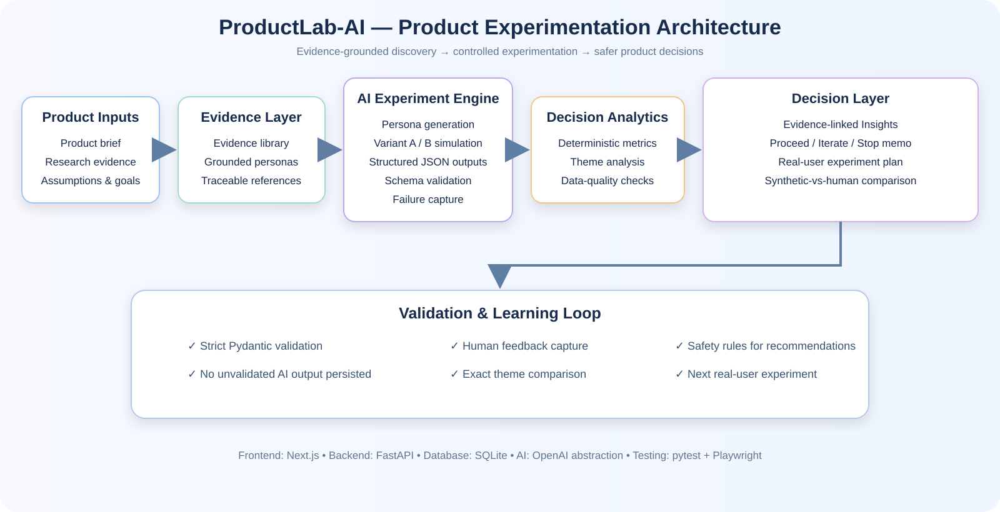
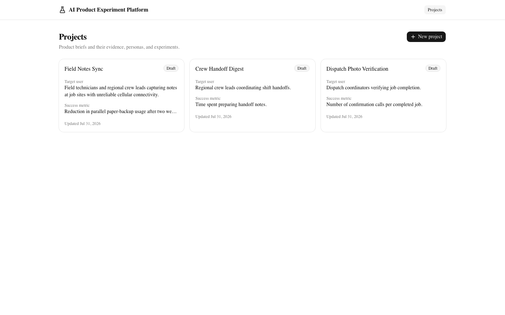
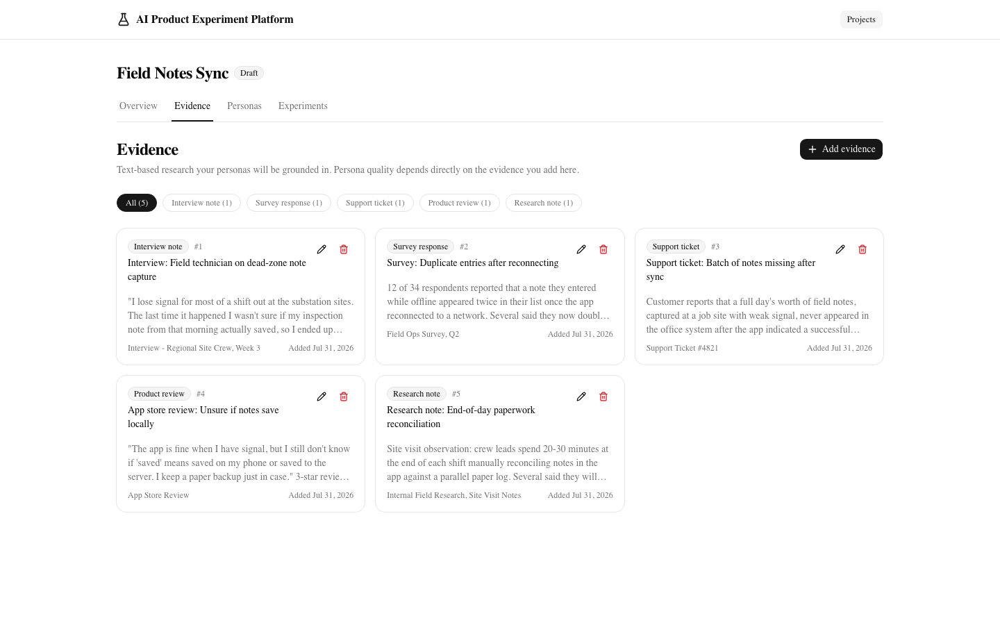
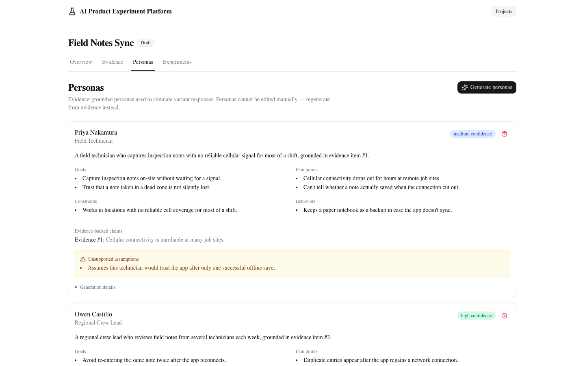
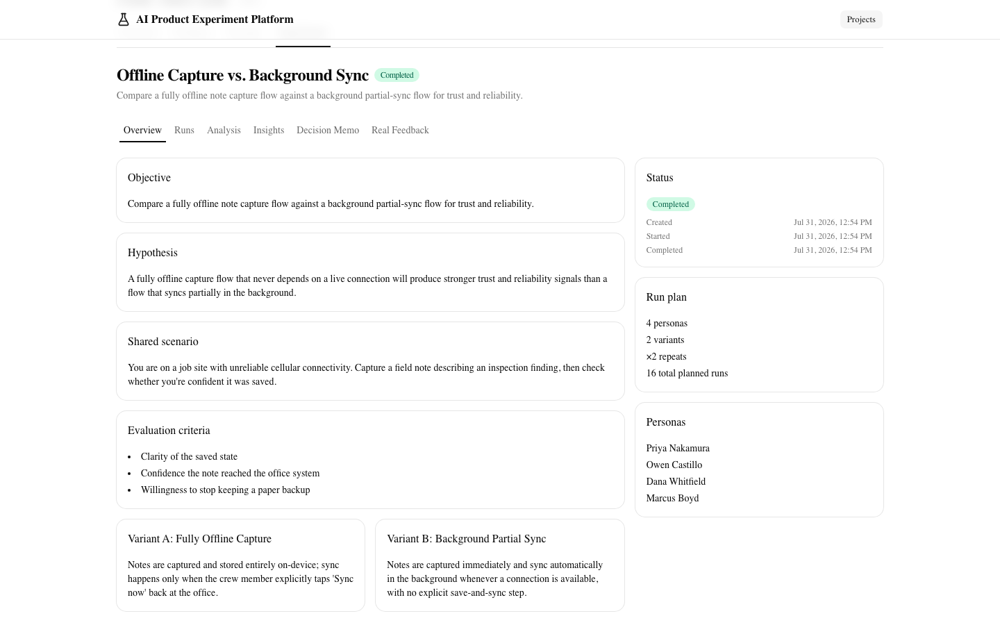
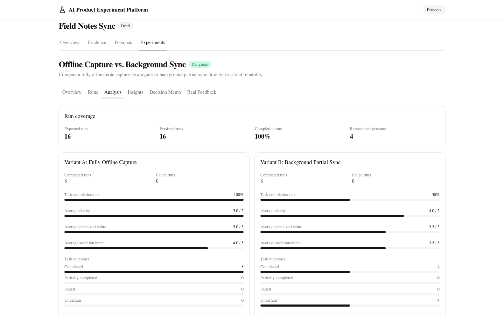
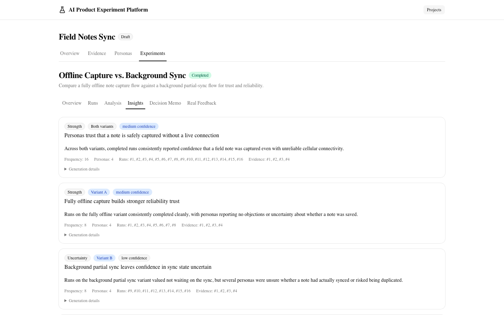
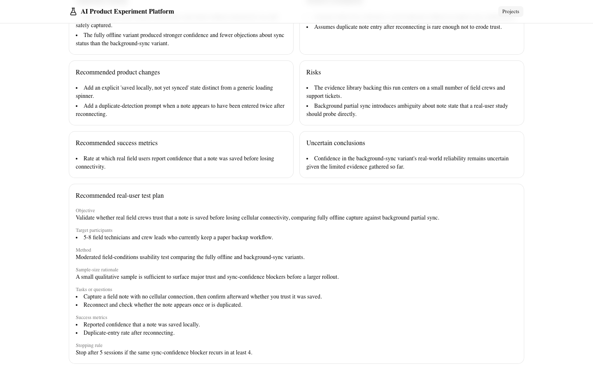
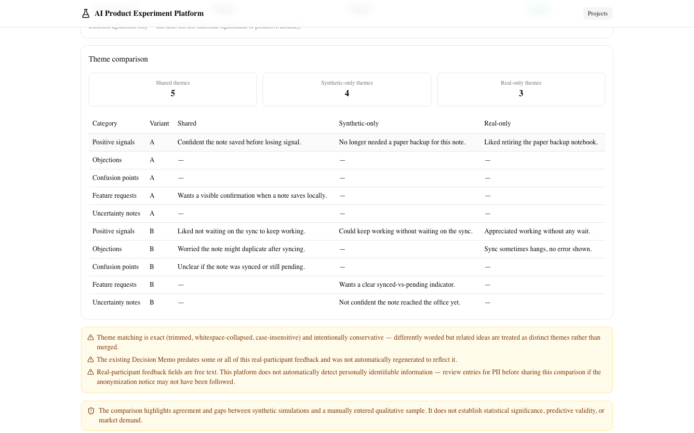

# ProductLab-AI — Evidence-Grounded Product Experimentation Platform

An AI-assisted product discovery and experimentation platform that turns existing research evidence into grounded synthetic personas, controlled product experiments, deterministic analytics, and safer real-user validation decisions.

[](https://github.com/abhi-iitg/productlab-ai-product-experimentation/actions/workflows/ci.yml)
[](LICENSE)

## Executive Summary

ProductLab-AI helps product teams move from **“an idea on a whiteboard”** to a structured, evidence-backed real-user experiment. It combines evidence-grounded synthetic personas, controlled Variant A/B simulations, strict AI-output validation, deterministic analytics, evidence-linked insights, and decision-safety rules.

### Architecture Visual



*The platform deliberately separates probabilistic AI generation from deterministic analytics, validation, and decision controls.*

---

## Recruiter-Focused Highlights

| Area | Demonstrated Capability |
|---|---|
| Product Management | Problem framing, personas, prioritization, roadmap, GTM, and experiment design |
| AI Engineering | Provider abstractions, structured outputs, prompt/context isolation, and validation boundaries |
| Backend Engineering | FastAPI services, SQLAlchemy persistence, Alembic migrations, and service-layer ownership |
| Analytics | Variant metrics, theme analysis, failure breakdowns, and synthetic-versus-human comparison |
| Quality Engineering | pytest, Playwright E2E, linting, build checks, and CI automation |
| Responsible AI | Uncertainty handling, escalation, explicit limitations, and decision-safety controls |

---

## Table of Contents

- [Live Demo](#live-demo)
- [Tech Stack & Architecture](#tech-stack--architecture)
- [Local Setup & Installation](#local-setup--installation)
  - [Backend Setup (FastAPI)](#backend-setup-fastapi)
  - [Frontend Setup (Nextjs)](#frontend-setup-nextjs)
- [Production Cloud Deployment](#production-cloud-deployment)
  - [1. Database Setup (Neon Postgres)](#1-database-setup-neon-postgres)
  - [2. Backend Setup (Render)](#2-backend-setup-render)
  - [3. Frontend Setup (Vercel)](#3-frontend-setup-vercel)
- [Deployment Notes](#deployment-notes)
- [Screenshots](#screenshots)
  - [Mobile workspace](#mobile-workspace)
- [Demo and case study](#demo-and-case-study)
- [Problem](#problem)
- [Product Workflow](#product-workflow)
- [Key Capabilities](#key-capabilities)
- [Reliable AI Architecture and Validation](#reliable-ai-architecture-and-validation)
- [Responsible Use and Limitations](#responsible-use-and-limitations)
- [Architecture](#architecture)
- [Important Engineering Decisions](#important-engineering-decisions)
- [AI and Validation Boundaries](#ai-and-validation-boundaries)
- [Deterministic Analytics and Decision Framework](#deterministic-analytics-and-decision-framework)
- [Synthetic-Versus-Human Comparison](#synthetic-versus-human-comparison)
- [Technology Stack](#technology-stack)
- [Repository Structure](#repository-structure)
- [Local Setup](#local-setup)
- [Environment Configuration](#environment-configuration)
- [Running Migrations](#running-migrations)
- [Running Backend and Frontend](#running-backend-and-frontend)
- [Testing](#testing)
- [API Overview](#api-overview)
- [Current Limitations](#current-limitations)
- [Future Extensions](#future-extensions)
- [Connect](#connect)
- [License](#license)

## Live Demo

You can access the live, fully deployed version of this application here:
👉 **[ProductLab AI - Live Web Application](https://productlab-ai-product-experimenta-git-91982c-mrabhishekaaa-4314.vercel.app/projects)**

## Tech Stack & Architecture
* **Python**
* **Next.js**
* **FastAPI**
* **Neon**

## Local Setup & Installation
### Backend Setup (FastAPI)
### Frontend Setup (Nextjs)

## Production Cloud Deployment
### 1. Database Setup (Neon Postgres)
### 2. Backend Setup (Render)
### 3. Frontend Setup (Vercel)

## Deployment Notes
* The backend automatically runs database schema migrations via `alembic upgrade head` upon deployment.
* CORS policies have been generalized (`*`) to facilitate direct, serverless communication between the detached frontend and backend architectures.
* *Note: If AI features return a `503` or a fallback state, it is because `OPENAI_API_KEY` is deliberately left unset on the production environment variables configuration, which is the expected behavior per design.*

## Screenshots

| | |
|---|---|
|  |  |
| Projects overview | Evidence library |
|  |  |
| Evidence-grounded personas | Two-variant experiment |
|  |  |
| Deterministic run analysis | Evidence-linked Insights |
|  |  |
| Proceed / Iterate / Stop decision memo | Synthetic-vs-human comparison |

### Mobile workspace

<p align="center">
  
</p>

## Demo and case study

- [Demo walkthrough](docs/demo.md) — reproducible 45–90 second portfolio demo of the full workflow (deterministic mode requires no OpenAI key)
- [Worked product experiment case study](docs/case-study.md) — Field Notes Sync scenario from hypothesis through decision memo and real-feedback comparison

The screenshots above use the same representative "Field Notes Sync" scenario shown in the demo and case study.

## Problem

Product teams often decide whether to pursue a product concept based on unstructured intuition, a handful of informal customer conversations, or only after committing significant engineering effort to a full build. Existing qualitative evidence — interviews, support tickets, reviews, prior research — is frequently collected but not systematically used to stress-test a new product hypothesis before real users are recruited. There is no lightweight, structured step between "an idea on a whiteboard" and "a live experiment with real users."

This platform provides that step: it turns evidence a team already has into evidence-grounded synthetic personas, uses those personas to compare two product concepts in a controlled experiment, and produces a decision memo that names the weakest assumptions and recommends a specific, small real-user experiment to run next.

## Product Workflow

```
Product brief
  → research evidence
  → evidence-grounded synthetic personas
  → controlled A/B experiment (Variant A / Variant B)
  → structured simulation runs
  → deterministic analytics
  → evidence-linked Insights
  → Proceed / Iterate / Stop Decision Memo
  → anonymized real-participant feedback
  → deterministic synthetic-versus-human comparison
```

A project owner authors a product brief and populates an evidence library. The platform generates personas strictly grounded in that evidence, with unsupported attributes explicitly flagged. The owner configures two product variants tested against a shared scenario, using the same personas, for a configurable number of repeats, and explicitly confirms before execution. Each simulation run produces a structured, schema-validated result. Deterministic analytics aggregate these into a comparison view, evidence-linked Insights cluster the recurring qualitative signal, and a Decision Memo recommends Proceed, Iterate, or Stop — always paired with a specific real-user follow-up experiment. Once that real-user test runs, its results can be entered and compared against the synthetic findings.

## Key Capabilities

- **Product brief** — name, problem statement, target user, hypothesis, success metric, assumptions.
- **Evidence library** — interview notes, survey responses, support tickets, product reviews, and research notes (text-based for this build).
- **Evidence-grounded personas** — goals, pain points, constraints, behaviors, evidence references, a confidence level, and explicit unsupported assumptions, generated only from the evidence supplied.
- **Controlled two-variant experiments** — Variant A and Variant B tested against the same personas and a shared scenario, a configurable repeat count (1–3), explicit execution confirmation, and a deterministic 30-run cap per experiment.
- **Structured simulation runs** — task outcome, clarity, perceived value, adoption intent, objections, confusion, feature requests, uncertainty notes, evidence references, and a safe, categorized failure record for every run that doesn't complete.
- **Deterministic analytics** — coverage, per-variant metrics, verbatim theme counts, evidence coverage, a failure breakdown, and persona disagreement — computed entirely from persisted data, no model calls involved.
- **Evidence-linked Insights** — recurring qualitative signal clustered into a small set of named findings, each one traceable back to the specific runs and evidence that produced it.
- **Decision Memo** — a Proceed / Iterate / Stop recommendation, supporting findings, weakest assumptions, risks, uncertain conclusions, and a fully specified real-user follow-up experiment.
- **Anonymized real-feedback entry** — manually enter feedback gathered from real participants once an experiment has run, using a pseudonymous label rather than any personal information.
- **Synthetic-versus-human comparison** — deterministic comparison of real feedback against the synthetic findings: shared themes, human-only themes, synthetic-only themes, score-direction alignment, and task-completion-rate deltas.

## Reliable AI Architecture and Validation

Every AI-generated result in this platform passes through a hard validation boundary before it is ever persisted or shown to a user:

- Structured JSON is requested from the model, parsed locally, and validated against a strict Pydantic schema — an evidence reference the model wasn't shown, a run ID it didn't produce, or a malformed field rejects the entire result rather than silently degrading.
- Four independent, swappable provider abstractions (persona generation, simulation execution, Insight generation, Decision Memo generation) mean each stage of the pipeline can be tested, versioned, and reasoned about in isolation — none of them share a prompt or a schema.
- A Decision Memo is never trusted on prompt instructions alone: deterministic decision-safety rules re-check the model's output in code after validation, blocking a `proceed` recommendation outright when the underlying data quality doesn't support it, and scanning every free-text field for forbidden market-validation language.
- Deterministic analytics, theme counting, and the synthetic-versus-human comparison run with **no model calls at all** — they are plain aggregation over already-persisted, already-validated data, kept deliberately separate from the parts of the system that do call an LLM.
- A dedicated failure explorer treats provider errors, timeouts, and validation failures as first-class, visible data — never a hidden retry or a silently dropped result.

## Responsible Use and Limitations

> "Synthetic feedback supports hypothesis generation and experiment planning. It does not replace real-user research or predict market success."

> "Real-participant feedback entered into this platform may represent a small qualitative sample. The comparison supports learning; it does not establish statistical significance or market validation."

A **Proceed** recommendation always means **"Proceed to real-user validation"** — it is never launch approval, and the Decision Memo service enforces this in code, not just in prompt wording. **Iterate** means important assumptions, confusion, or evidence gaps should be addressed before real-user validation. **Stop** means the current concept shouldn't receive further investment in its present form — it does not prove the broader market opportunity is invalid.

This platform does not predict customer behavior, validate product-market fit, replace user research, prove market demand, or determine launch readiness. It supports hypothesis generation and helps design a better real-user experiment — nothing more.

## Architecture

```
Next.js Product Dashboard
            ↓
         FastAPI
            ↓
   Product Brief Service
            ↓
      Evidence Service
            ↓
      Persona Service
            ↓
 Experiment Orchestrator
      ┌─────┴─────┐
      ↓           ↓
 Variant A     Variant B
 Simulations   Simulations
      └─────┬─────┘
            ↓
     Analytics Service
            ↓
 Recommendation Service
            ↓
Human Feedback Service ←→ Human Comparison Service
            ↓
 SQLAlchemy + Alembic + SQLite
```

The frontend talks only to FastAPI — never directly to the database or an LLM provider. Only the Persona Service, the Variant A/B Simulations, Insight generation, and the Recommendation Service call an LLM abstraction; the Analytics Service and the Human Comparison Service operate purely on already-persisted, already-validated data. See [`docs/architecture.md`](docs/architecture.md) for full service boundaries, request/persistence flow, and sequence diagrams.

## Important Engineering Decisions

- **SQLite and synchronous execution are deliberate MVP tradeoffs**, not oversights. The platform targets single-user, portfolio-scale usage rather than concurrent multi-tenant load; simulation runs are I/O-bound on LLM provider latency rather than CPU-bound, so synchronous, in-process execution keeps the orchestration easy to trace and test without a task queue. PostgreSQL and asynchronous/queued execution are documented future extensions if concurrency requirements emerge — see [`docs/architecture.md`](docs/architecture.md#why-sqlite-and-synchronous-execution-are-appropriate-for-the-mvp).
- **Every LLM response is validated before persistence.** Raw provider output is parsed with `json.loads` and validated against a strict Pydantic schema, with cross-references (evidence IDs, run IDs, Insight IDs) checked in the same pass. No unvalidated model output ever reaches the database.
- **Persona generation and Insight generation persist atomically** (an invalid item rejects the whole batch); **experiment execution commits each run independently**, so a failure on run *N* never erases runs `1..N-1` that already succeeded. This intentional split is documented in [`docs/architecture.md`](docs/architecture.md).
- **The competing variant is excluded from a single run's context.** Each simulation run only sees its own active variant, never the other one, so the model is never directly steered toward a comparative preference between A and B.
- **Deterministic services never call an LLM.** The Analytics Service and the Human Comparison Service are pure aggregation over persisted data — this boundary is enforced by code review discipline and covered by tests, not just documentation.

## AI and Validation Boundaries

Every LLM response — persona generation, simulation runs, Insight generation, Decision Memo generation — is treated as untrusted input:

1. The LLM abstraction requests structured JSON output from the provider.
2. The raw response is parsed as JSON; malformed JSON is recorded as a failure, never retried silently or persisted as a partial result.
3. Parsed JSON is validated against a strict Pydantic schema, with cross-reference checks (evidence IDs, run IDs, Insight IDs, frequency/persona-count consistency) run in the same validation pass.
4. Only schema-valid data is persisted. For personas, Insights, and Decision Memos, an invalid item rejects the entire batch. For simulation runs, a validation failure is persisted as an explicit per-run failure record instead.
5. For Decision Memos specifically, deterministic decision-safety rules run after schema validation and are treated exactly like a schema failure if violated — nothing unsafe is ever persisted.

**An OpenAI API key is needed only for real local AI generation.** The application starts, and every non-generation route works, with no key configured at all — persona generation, simulation execution, Insight generation, and Decision Memo generation return a `503` until `OPENAI_API_KEY` is set. Automated tests never make a live OpenAI call: `PersonaLLMProvider`, `SimulationLLMProvider`, `InsightLLMProvider`, and `DecisionMemoLLMProvider` are typed `Protocol`s, and every pytest and Playwright run injects a deterministic fake implementation instead (`backend/tests/fakes.py` for pytest).

**The deterministic E2E fake-provider mode is test-only.** `Settings.E2E_FAKE_AI` defaults to `False`, and a Pydantic model validator refuses to construct `Settings` at all if `E2E_FAKE_AI=true` is set while `APP_ENV` is anything other than `"test"` — this is an enforced construction-time guard, not a convention. When active, `app/llm/factory.py` swaps in deterministic in-process fakes (`app/llm/e2e_fake_providers.py`) that derive schema-valid responses from whatever the real UI actually created during that test run, so the Playwright suite exercises real routing, real request/response validation, and a real (isolated) database — with no network access and no API key.

## Deterministic Analytics and Decision Framework

`GET /api/v1/projects/{project_id}/experiments/{experiment_id}/analysis` returns coverage, per-variant metrics (completion rate, average clarity/perceived-value/adoption-intent scores, latency, tokens, estimated cost), verbatim theme counts, evidence coverage, a failure breakdown, persona disagreement, and structured data-quality flags — computed entirely from already-persisted `SimulationRun` rows, with no LLM call and no database write.

Insight generation clusters that signal into a small set of evidence-linked findings; the Decision Memo then applies deterministic decision-safety rules on top of the model's structured output:

1. A `proceed` recommendation's summary must explicitly name real-user validation, not launch.
2. `proceed` is rejected outright when data-quality flags show a variant with zero completed runs, severe run-failure imbalance, or fewer than two represented personas.
3. When no completed run cites supporting evidence, the memo must include an uncertainty warning and recommend collecting real evidence.
4. The memo may never claim synthetic results prove market demand, product-market fit, a conversion rate, or launch readiness — every free-text field is scanned for a fixed list of forbidden phrases.

See [`docs/decision-framework.md`](docs/decision-framework.md) for the full framework, including exactly how Proceed / Iterate / Stop are defined and enforced.

## Synthetic-Versus-Human Comparison

Once an experiment has completed runs, a PM can enter anonymized feedback from real participants — a pseudonymous label, variant, scores, and free-text themes, never names, emails, or other personal information. `HumanComparisonService` then deterministically compares it against the persisted synthetic `SimulationRun`s: per-variant aggregation, **exact** normalized theme matching (shared / human-only / synthetic-only — intentionally conservative, no fuzzy matching or embeddings), A-vs-B score-direction alignment, and task-completion-rate deltas. The comparison makes no LLM calls and no writes, and a standing warning documents its small-sample nature on every response.

## Technology Stack

**Frontend:** Next.js 16 (App Router), TypeScript, Tailwind CSS, shadcn/ui, TanStack Query, React Hook Form, Zod, Lucide icons

**Backend:** FastAPI, Pydantic, SQLAlchemy, Alembic

**Database:** SQLite

**AI:** OpenAI, via four independently swappable provider abstractions, structured JSON output, local parsing and Pydantic validation before persistence

**Testing:** pytest (668 tests, 94% coverage), Playwright (21 end-to-end tests)

**CI:** GitHub Actions — backend quality (Ruff, pytest, Alembic check), frontend quality (ESLint, production build, `npm audit`), and the full Playwright suite, on every push and pull request to `main`

## Repository Structure

```
backend/
  app/
    api/routes/       FastAPI routers (thin — delegate to services)
    core/              settings, logging, centralized exception handling
    database/          SQLAlchemy base + session management
    llm/               provider abstractions, prompts, context builders, factory
    models/            SQLAlchemy ORM models
    repositories/      persistence-only data access layer
    schemas/           Pydantic request/response + raw-LLM-output validation
    services/          business logic, transaction ownership
  alembic/             database migrations
  tests/               pytest suite (668 tests) + deterministic fakes
frontend/
  app/                 Next.js App Router routes
  components/          UI components by feature area
  hooks/                TanStack Query hooks
  lib/api/             centralized typed API client
  lib/validation/       Zod schemas for React Hook Form
  e2e/                  Playwright end-to-end suite (21 tests)
docs/
  demo.md
  case-study.md
  architecture.md
  product-specification.md
  decision-framework.md
  testing.md
  screenshots/
```

## Local Setup

Requires Python 3.13+ and Node.js 20+.

```bash
git clone https://github.com/abhi-iitg/productlab-ai-product-experimentation.git
cd productlab-ai-product-experimentation
```

## Environment Configuration

Copy the root template to both apps and adjust as needed:

```bash
cp .env.example backend/.env
cp .env.example frontend/.env.local
```

| Variable | Purpose | Local default |
|---|---|---|
| `APP_NAME` | Display name returned by `GET /health` | `ProductLab-AI Product Experimentation API` |
| `APP_ENV` | `development` \| `test` \| `production` | `development` |
| `APP_DEBUG` | Enables debug behavior | `true` |
| `API_PREFIX` | Prefix all API routes are mounted under | `/api/v1` |
| `DATABASE_URL` | SQLAlchemy database URL | `sqlite:///./data/app.db` |
| `CORS_ORIGINS` | Comma-separated origins allowed to call the API | `http://localhost:3000` |
| `LOG_LEVEL` | Python logging level | `INFO` |
| `OPENAI_API_KEY` | Required only for real AI generation — every other route works without it | `changeme` |
| `OPENAI_MODEL` | Model used for structured JSON output | `gpt-4o-mini` |
| `NEXT_PUBLIC_API_BASE_URL` | Base URL the frontend uses to reach the backend | `http://localhost:8000` |

Leave `OPENAI_API_KEY` unset (or as `changeme`) to run the app and its full test suite without ever calling OpenAI — generation endpoints return a `503` instead.

## Running Migrations

```bash
cd backend
python3 -m venv .venv
source .venv/bin/activate
pip install -e ".[dev]"

alembic upgrade head
```

## Running Backend and Frontend

```bash
# backend (from backend/, with the virtualenv above activated)
uvicorn app.main:app --reload   # http://localhost:8000

# frontend (from frontend/, in a separate terminal)
npm install
npm run dev                      # http://localhost:3000, redirects to /projects
```

## Testing

```bash
# backend — from backend/
ruff check .
ruff format --check .
pytest --cov=app                 # 668 tests, 94% coverage

# frontend — from frontend/
npm run lint
npm run build
npm audit --omit=dev

# full-stack Playwright E2E suite (starts both apps itself)
npm run test:e2e                 # 21 tests
```

The Playwright suite drives the real FastAPI app and the real Next.js app through a real Chromium browser against an isolated, freshly migrated SQLite database, with deterministic fake AI providers (`APP_ENV=test`, `E2E_FAKE_AI=true`) — no OpenAI key is ever used or required. See [`docs/testing.md`](docs/testing.md) for full detail on both suites and CI.

## API Overview

All routes are mounted under `API_PREFIX` (`/api/v1` by default).

| Resource | Routes |
|---|---|
| Health | `GET /health` |
| Projects | `POST/GET /projects`, `GET/PATCH/DELETE /projects/{id}` |
| Evidence | `POST/GET /projects/{id}/evidence`, `GET/PATCH/DELETE /projects/{id}/evidence/{id}` |
| Personas | `POST /projects/{id}/personas/generate`, `GET /projects/{id}/personas`, `GET/DELETE /projects/{id}/personas/{id}` |
| Experiments | `POST/GET /projects/{id}/experiments`, `GET/PATCH/DELETE /projects/{id}/experiments/{id}`, `POST .../execute`, `GET .../runs`, `GET .../runs/{id}` |
| Analysis | `GET .../analysis`, `POST/GET .../insights/generate`, `GET .../insights`, `POST/GET .../decision-memo/generate`, `GET .../decision-memo` |
| Human feedback | `POST/GET .../human-feedback`, `GET/PATCH/DELETE .../human-feedback/{id}`, `GET .../human-feedback/comparison` |

See [`docs/architecture.md`](docs/architecture.md) for full request/response examples and validation behavior per endpoint.

## Current Limitations

- No authentication or multi-tenant support.
- SQLite and synchronous, in-process execution — appropriate for single-user, portfolio-scale usage, not concurrent production load.
- Text-based evidence only; no PDF, audio, or image parsing.
- Qualitative theme matching in the synthetic-versus-human comparison is exact, normalized string matching — not fuzzy matching or embeddings — so differently worded but related ideas are treated as distinct themes.
- No automatic PII detection on entered human feedback; a standing reminder is shown instead.
- No deployment configuration is included — this repository documents local setup only.

## Future Extensions

Explicitly out of scope for this build, documented as possible future directions:

- Authentication and multi-user workspaces
- PostgreSQL and asynchronous execution for scale
- A background task queue (e.g., Celery with Redis) for long-running simulation batches
- Support for multiple LLM providers and cross-provider comparison
- A vector database for semantic evidence retrieval
- File parsing beyond plain text (PDF, audio transcripts, images)
- Observability/tracing integrations
- Enterprise integrations (SSO, ticketing systems, CRM connectors)
- Containerized or cloud deployment

## Connect

If you found this project interesting and have feedback, feel free to star and fork the repository, and follow for more such insightful projects!

My Portfolio & Profiles: 
- **Email : mr.abhishekaaa@gmail.com**
- **[Portfolio](https://abhishek-kg-portfolio.vercel.app/)**
- **[LinkedIn](https://www.linkedin.com/in/abhishekkumargond/)**
- **[GitHub](https://github.com/abhi-iitg/productlab-ai-product-experimentation)**
  
---

## License

Released under the [MIT License](LICENSE).
