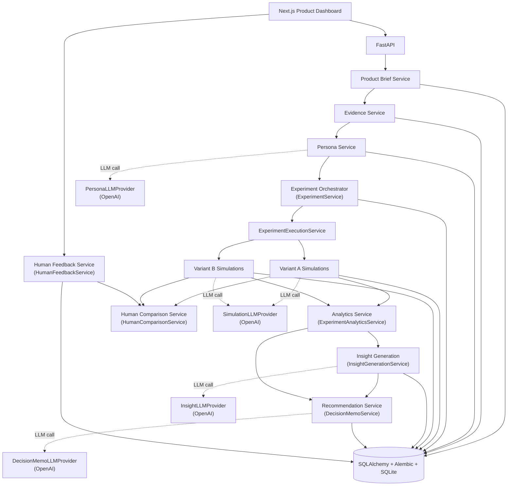
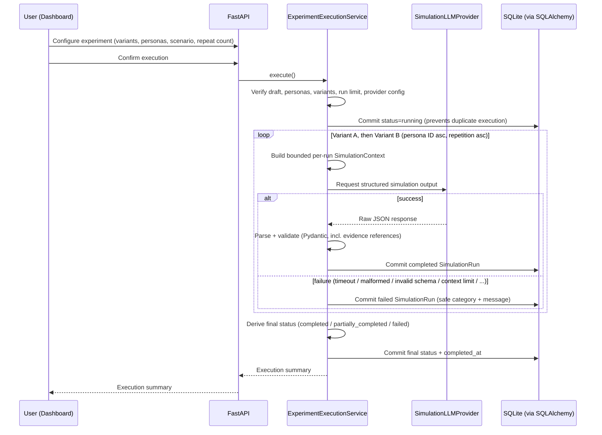
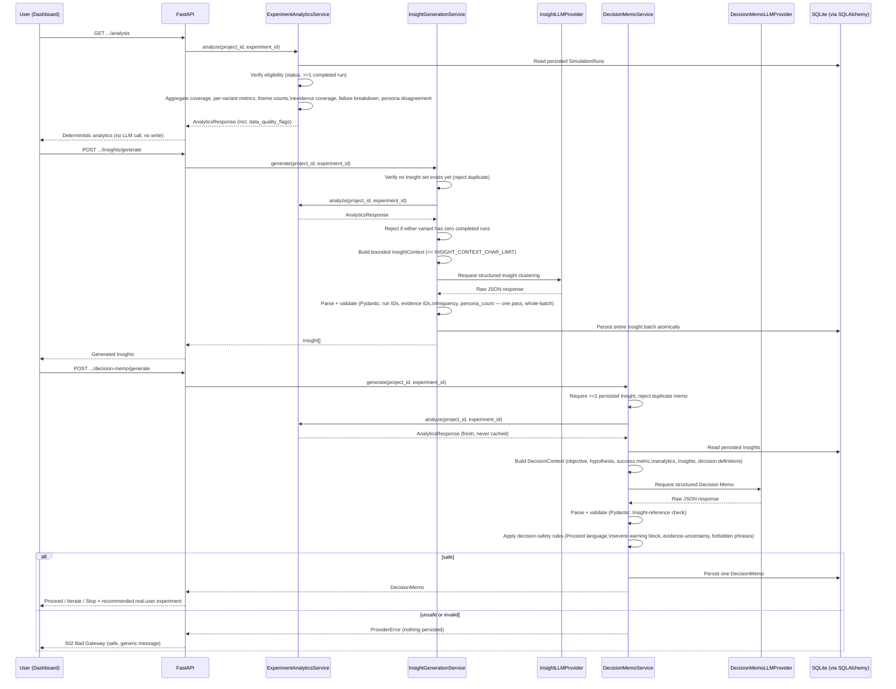

# Architecture

This document describes the implemented architecture end-to-end: the
FastAPI application factory, configuration, SQLAlchemy engine/session
layer, and Alembic migrations (see `backend/app/`); the `Project` and
`EvidenceItem` domain models and their CRUD API (Product Brief Service and
Evidence Service); the `Persona` domain model, the OpenAI provider
abstraction, the deterministic evidence context builder, and the Persona
Service (generate/list/get/delete — no manual persona creation or
editing); the `Experiment`, `Variant`, and `SimulationRun` domain models,
the Experiment Orchestrator (`ExperimentService` for draft CRUD and
`ExperimentExecutionService` for execution), and the Variant A/B
Simulations (via a separate `SimulationLLMProvider` abstraction); the
`Insight` and `DecisionMemo` domain models, the Analytics Service
(`ExperimentAnalyticsService`), Insight generation
(`InsightGenerationService` via a separate `InsightLLMProvider`
abstraction), and the Recommendation Service (`DecisionMemoService` via a
separate `DecisionMemoLLMProvider` abstraction); the Next.js Product
Dashboard (`frontend/`), implemented end-to-end against this API — project
briefs, the evidence library, persona generation, two-variant experiment
configuration and execution, run-level results, deterministic analytics,
Insight generation, and the decision memo, via a centralized typed API
client and TanStack Query data layer; the `HumanFeedback` domain model, the
Human Feedback Service (`HumanFeedbackService`), and the deterministic
Human Comparison Service (`HumanComparisonService`), plus a "Real Feedback"
tab in the Next.js dashboard so a PM can manually enter anonymized
real-participant feedback per experiment and view a deterministic
comparison against the persisted synthetic `SimulationRun` results (both
services call no LLM abstraction); and a centralized LLM provider factory
(`app/llm/factory.py`), a test-only `E2E_FAKE_AI` setting, and a Playwright
end-to-end suite (`frontend/e2e/`) — see "E2E Fake-Provider Architecture"
below — alongside GitHub Actions CI (`.github/workflows/ci.yml`).

## Architecture Goals

- Keep the MVP small and inspectable end-to-end, with no hidden
  infrastructure.
- Enforce a hard validation boundary between LLM output and persisted data.
- Keep frontend and backend responsibilities cleanly separated.
- Treat failure states (provider errors, malformed output) as first-class,
  visible data rather than exceptions swallowed silently.
- Avoid infrastructure the MVP does not need (queues, caches, multi-service
  orchestration, multiple data stores).

## System Component Responsibilities

- **Next.js Product Dashboard** *(implemented as the `frontend/` App Router app; the Real Feedback tab is part of it)* — presentation
  layer only. Renders product briefs, the evidence library, personas,
  experiment configuration and execution, run-level results, the
  comparison dashboard, the decision memo, and anonymized real-feedback
  entry with its real-vs-synthetic comparison view. Contains no business
  logic and no direct persistence; talks to FastAPI exclusively through a
  centralized typed fetch client (`frontend/lib/api/`).
- **FastAPI** — the HTTP boundary. Performs request/response validation via
  Pydantic and routes requests to the appropriate service.
- **Product Brief Service** *(implemented as `ProjectService`)* — creates,
  lists, reads, updates, and deletes product briefs (name, problem
  statement, target user, hypothesis, success metric, assumptions,
  status). Deleting a project cascades to its evidence items.
- **Evidence Service** *(implemented as `EvidenceService`)* — manages the
  evidence library (text-based interview notes, survey responses, support
  tickets, reviews, research notes) scoped to a project; every operation
  confirms the evidence item belongs to the given project, so evidence
  from one project is never retrievable or editable through another
  project's ID.
- **Persona Service** *(implemented as `PersonaGenerationService`)* —
  generates evidence-grounded personas from a project's evidence library
  via the LLM abstraction, enforcing that every persona records its
  evidence references, a confidence level, and explicit unsupported
  assumptions. Verifies every model-cited evidence reference against the
  evidence actually supplied in the generation context and persists every
  persona in one transaction; an invalid reference or any schema-validation
  failure rejects the entire generation result — no partial persistence.
- **Experiment Orchestrator** *(implemented as `ExperimentService` +
  `ExperimentExecutionService`)* — `ExperimentService` owns draft-only CRUD
  for a two-variant experiment (same personas, same scenario, configurable
  repeat count 1-3), enforcing the deterministic 30-run limit
  (`personas x 2 variants x repeat_count`) at creation time. Editing or
  deleting an experiment is rejected once it is no longer `draft`.
  `ExperimentExecutionService` verifies explicit user confirmation, the
  selected personas/variants are still valid, and provider configuration,
  then dispatches the run matrix for Variant A and Variant B in stable
  order.
- **Variant A / Variant B Simulations** *(implemented via the
  `SimulationLLMProvider` abstraction)* — independent structured simulation
  runs per persona and repeat, one context build and one provider call per
  run, producing schema-validated structured results or a safe, categorized
  failure record. Each run's context includes only the *active* variant —
  never the competing one — so the model is never directly steered toward a
  comparative preference.
- **Analytics Service** *(implemented as `ExperimentAnalyticsService`)* —
  aggregates persisted simulation results into comparative metrics:
  coverage, per-variant completion/clarity/perceived-value/adoption-intent/
  latency/tokens/cost, deterministic theme counts, evidence coverage, a
  failure breakdown, persona disagreement, and data-quality warnings/flags.
  Makes no LLM calls and no database writes.
- **Insight Generation** *(implemented as `InsightGenerationService`, via a
  separate `InsightLLMProvider` abstraction)* — clusters recurring
  qualitative signals from an experiment's completed runs into a small,
  locally validated, evidence-linked set of `Insight` records, persisted
  atomically.
- **Recommendation Service** *(implemented as `DecisionMemoService`, via a
  separate `DecisionMemoLLMProvider` abstraction)* — derives the
  Proceed/Iterate/Stop decision memo, weakest assumptions, risks, uncertain
  conclusions, and the recommended real-user experiment from the persisted
  Insights and the Analytics Service's output, enforcing responsible-AI
  decision-safety rules after every provider response.
- **Human Feedback Service** *(implemented as `HumanFeedbackService`)* —
  create/list/get/update/delete for anonymized real-participant feedback
  entered manually by the PM, scoped to a project and experiment. Feedback
  may only be *added* while the experiment is `completed` or
  `partially_completed`; editing and deletion are always allowed, since
  manually entered research data may need correction. No PII fields are
  collected; a uniqueness constraint on `(experiment_id, participant_label,
  variant_key)` prevents accidental duplicate entry.
- **Human Comparison Service** *(implemented as `HumanComparisonService`)*
  — deterministically compares persisted `SimulationRun`s against
  `HumanFeedback` records: per-variant synthetic/human aggregation, exact
  normalized qualitative theme matching (shared / synthetic-only /
  human-only), A-vs-B score-direction alignment, task-completion-rate
  deltas, and data-quality warnings. Makes no LLM calls, no embeddings
  calls, and no database writes.
- **Persistence** — SQLAlchemy models with Alembic migrations against
  SQLite.

## Service Boundaries

- Only the Persona Service, the Variant Simulations
  (`ExperimentExecutionService`, via `SimulationLLMProvider`), Insight
  Generation (via `InsightLLMProvider`), and the Recommendation Service
  (via `DecisionMemoLLMProvider`) call an LLM abstraction; no other service
  performs model calls. `ExperimentService` (CRUD) never does.
- The Analytics Service operates purely on already-persisted,
  already-validated structured data and never calls an LLM abstraction or
  writes to the database. Insight Generation and the Recommendation Service
  each call an LLM abstraction exactly once per request, always preceded by
  a fresh read of the Analytics Service's deterministic output — neither
  service re-invokes the LLM to "double check" a result.
- The Human Comparison Service, like the Analytics Service, operates
  purely on already-persisted, already-validated data (`SimulationRun` and
  `HumanFeedback`) and never calls an LLM abstraction or writes to the
  database. It deliberately does not import `ExperimentAnalyticsService`
  — the two deterministic services stay decoupled and each recomputes its
  own eligibility conditions independently.
- The frontend talks only to FastAPI; it has no direct database or LLM
  access.
- Each service depends on the repository layer for persistence; the API
  layer never touches SQLAlchemy models directly.

## Request Flow

1. *(Implemented)* Frontend submits a product brief → FastAPI → Product
   Brief Service → repository → SQLite.
2. *(Implemented)* Frontend adds evidence items → Evidence Service →
   repository → SQLite.
3. *(Implemented)* Frontend requests persona generation → Persona Service
   reads evidence via the repository → builds a deterministic context →
   LLM abstraction → structured output is parsed locally and validated
   (including evidence-reference verification) → repository → SQLite, all
   in one transaction.
4. *(Implemented)* Frontend configures a two-variant experiment (draft) and
   gives explicit execution confirmation → `ExperimentExecutionService`
   verifies personas/variants/provider configuration, flips the experiment
   to `running`, then dispatches Variant A and Variant B simulation runs in
   stable order.
5. *(Implemented)* Each simulation run: `ExperimentExecutionService` builds
   a bounded per-run context → `SimulationLLMProvider` → structured JSON →
   Pydantic validation (including evidence-reference verification against
   the persona's own evidence) → repository → SQLite, committed
   independently per run (including explicit, safely-categorized failure
   records when the context is too large or the provider call/validation
   fails).
6. *(Implemented)* Frontend requests the comparison dashboard →
   `ExperimentAnalyticsService` reads persisted simulation runs →
   aggregates and returns deterministic comparative metrics — no LLM call,
   no write.
7. *(Implemented)* Frontend requests Insight generation →
   `InsightGenerationService` re-verifies eligibility, calls
   `ExperimentAnalyticsService` for fresh metrics, builds a bounded context
   from completed runs, calls `InsightLLMProvider` → structured JSON →
   Pydantic validation (including run/evidence-reference, frequency, and
   persona-count verification) → the entire Insight batch is persisted in
   one transaction.
8. *(Implemented)* Frontend requests the decision memo →
   `DecisionMemoService` requires persisted Insights, recomputes analytics,
   calls `DecisionMemoLLMProvider` → structured JSON → Pydantic validation
   (including Insight-reference verification) → decision-safety rules are
   applied → one `DecisionMemo` is persisted.
9. *(Implemented)* Frontend enters anonymized human feedback →
   `HumanFeedbackService` verifies eligibility (`completed` or
   `partially_completed`) → repository → SQLite. Frontend requests the
   comparison → `HumanComparisonService` reads persisted `SimulationRun`s
   and `HumanFeedback` → deterministically aggregates and compares both
   sides, producing shared, human-only, and synthetic-only themes,
   score-direction alignment, task-completion-rate deltas, and data-quality
   warnings — no LLM call, no write.

## Persistence Flow

Domain entities: `Project`, `EvidenceItem`, `Persona`, `Experiment`,
`Variant`, `SimulationRun`, `Insight`, `DecisionMemo`, `HumanFeedback`
*(all implemented)*.

- A `Project` owns `EvidenceItem`s, `Persona`s, and `Experiment`s
  *(implemented, all with cascade delete)*.
- An `Experiment` owns exactly two `Variant`s (A and B, cascade delete) and
  references the `Persona`s used in it via the `experiment_personas`
  association table, so the selected persona set stays reproducible even
  if the project's persona library later grows *(implemented)*.
- An `Experiment` also owns many `SimulationRun`s (cascade delete), each
  referencing the `Variant` and `Persona` it ran against, with a uniqueness
  constraint on `(experiment_id, variant_id, persona_id, repetition_index)`
  preventing duplicate rows *(implemented)*.
- An `Experiment` also owns many `Insight`s (cascade delete), each
  referencing the completed `SimulationRun`s and evidence IDs that ground
  it, with a uniqueness constraint on `(experiment_id, title, category,
  variant_scope)` — Insights are the structured, evidence-linked findings
  consumed by the Recommendation Service *(implemented)*.
- An `Experiment` owns exactly one `DecisionMemo` (cascade delete,
  uniqueness constraint on `experiment_id`), which references the
  `Insight`s that grounded it via `supporting_insight_ids` *(implemented)*.
- An `Experiment` also owns many `HumanFeedback` records (cascade delete),
  each belonging to exactly one `Experiment`, with a uniqueness constraint
  on `(experiment_id, participant_label, variant_key)` — one participant
  may evaluate both variants when the PM intentionally chooses that design,
  but not submit duplicate feedback for the same participant and variant
  *(implemented)*. `HumanFeedback` is compared against `SimulationRun`s
  (not `Insight`s) by `HumanComparisonService`, since the comparison is
  defined over raw synthetic results, not LLM-clustered themes.

All writes go through the repository layer; Alembic manages schema
migrations.

## Structured-Output Validation Boundary

Every LLM response (persona generation, simulation runs, Insight
generation, Decision Memo generation — all *(implemented)*) is treated as
untrusted input:

1. The LLM abstraction requests structured JSON output from the provider.
2. The raw response is parsed as JSON. Malformed JSON is caught and recorded
   as a failure — it is not retried silently or persisted as a partial
   result.
3. Parsed JSON is validated against a strict Pydantic schema for that
   operation (the persona schema, the simulation-result schema, the Insight
   schema, or the Decision Memo schema), with cross-references (evidence
   IDs, run IDs, Insight IDs, frequency/persona-count consistency) checked
   in the same pass via Pydantic's validation `context`.
4. Only schema-valid data is persisted as a successful result. For
   personas, Insights, and Decision Memos, an invalid item rejects the
   *entire* batch/result — never a partial one. For simulation runs,
   validation failures are persisted as explicit per-run failure records
   (with model/provider failure information), visible in the failure
   explorer.
5. For Decision Memos specifically, a sixth step follows schema validation:
   the decision-safety rules (see "Decision Safety Rules" above) are
   checked against the deterministic analytics. A rule violation is treated
   as unusable provider output, exactly like a schema failure.
6. No unvalidated LLM output ever reaches the database.

## Error-Handling Principles

- Provider errors (timeouts, rate limits, malformed responses) are captured
  as structured failure records, not unhandled exceptions.
- Failures are surfaced to the user through the failure explorer rather
  than hidden or silently retried indefinitely.
- Services fail at their own boundary; the API layer translates internal
  errors into well-formed HTTP responses.
- No partial or unvalidated data is ever persisted as if it were a complete
  result.

## Testing Boundaries

- Unit tests cover services, repositories, and schema validation logic in
  isolation.
- The LLM abstraction is always mocked or stubbed in automated tests — no
  live OpenAI calls in CI or local test runs.
- Playwright end-to-end tests exercise the full
  workflow through the real UI against a real FastAPI instance and a real
  migrated SQLite database, with deterministic fake LLM providers — see
  "E2E Fake-Provider Architecture" below.
- Contract-style tests validate that structured LLM output schemas match
  what the Analytics and Recommendation services expect.

## E2E Fake-Provider Architecture

Playwright needs the *real* FastAPI application — not a mocked HTTP layer —
so that end-to-end coverage exercises real routing, real request/response
validation, and a real database, exactly like a production deployment.
That real app still must never call OpenAI or require an API key during a
test run. Two pieces make that possible:

- **`Settings.E2E_FAKE_AI`** (`app/core/config.py`) — a `bool` field,
  default `False`. A `model_validator` on `Settings` itself refuses to
  construct (raising a `pydantic.ValidationError`, so the process fails to
  start) if `E2E_FAKE_AI=true` is set while `APP_ENV` is anything other
  than `"test"`. This is the actual enforcement point — not a convention,
  not a runtime check that could be skipped.
- **`app/llm/factory.py`** — the single place that decides real vs. fake
  provider selection for all four LLM-calling services (Persona, Variant
  Simulations, Insight Generation, the Recommendation Service). Each
  route's existing `get_*_provider()` dependency (in `personas.py`,
  `experiments.py`, `analysis.py`) now delegates to one `build_*_provider()`
  factory function instead of constructing an `OpenAI*Provider` directly —
  route functions themselves contain no fake/real branching logic at all.
  The factory re-checks the `APP_ENV=test` guard defensively (raising
  `RuntimeError`) so it stays safe even if called outside the FastAPI
  dependency graph.
- **`app/llm/e2e_fake_providers.py`** — deterministic, in-process fake
  implementations of all four provider protocols (`E2EFakePersonaProvider`,
  `E2EFakeSimulationProvider`, `E2EFakeInsightProvider`,
  `E2EFakeDecisionMemoProvider`), selected only via the factory above. Each
  one derives a schema-valid response directly from whatever the caller
  passes in (the actual evidence IDs, run IDs, or Insight IDs created
  through the real UI during that test), rather than requiring a
  pre-configured canned result — unlike `backend/tests/fakes.py`, which is
  pytest-only and never imported by `app/`. No network access, no API key,
  fully deterministic for a given database state.

Playwright itself (`frontend/playwright.config.ts`) starts the backend with
`APP_ENV=test`, `E2E_FAKE_AI=true`, and `DATABASE_URL` pointing at an
isolated `backend/data/e2e-test.db` — never the developer's own
`data/app.db`. `backend/scripts/prepare_e2e_db.py` deletes any existing
E2E database file and runs `alembic upgrade head` against it before
`uvicorn` starts, so every run begins from an identical, empty, fully
migrated schema; the script itself refuses to run unless `APP_ENV=test`
and `DATABASE_URL` looks like a dedicated E2E path, as a second safety net
against ever touching a real database.

## Execution Component Responsibilities

- **`ExperimentService`** — draft-only CRUD for `Experiment`/`Variant`,
  persona-selection validation (unique IDs, same project), the deterministic
  30-run-limit check, and read-only access to persisted `SimulationRun`s.
  Never calls an LLM abstraction.
- **`ExperimentExecutionService`** — the only place execution happens.
  Re-verifies the experiment is `draft`, confirmation was given, the
  selected personas/variants are still valid, and the run limit; verifies
  provider configuration; flips the experiment to `running`; then runs the
  Variant A/B x persona x repeat matrix synchronously in stable order,
  building one `SimulationContext` and making one provider call per run.
- **`SimulationLLMProvider`** — a typed `Protocol` distinct from
  `PersonaLLMProvider`, implemented by `OpenAISimulationProvider`
  (production) and `FakeSimulationProvider` (tests). Keeps persona
  generation and simulation execution independently swappable.

## Analytics, Insight Generation, and Decision Memo Responsibilities

- **`ExperimentAnalyticsService`** — the Analytics Service. Retrieves and
  aggregates an Experiment's already-persisted, already-validated
  `SimulationRun` rows into coverage counts, per-variant metrics
  (completion, task-outcome distribution, average clarity/perceived-value/
  adoption-intent scores, latency, token totals, estimated cost),
  deterministic theme counts, evidence coverage, a failure breakdown, and
  persona disagreement. Makes **no LLM calls and no database writes** — it
  is pure aggregation over data other services already validated and
  persisted. Enforces analysis eligibility (status must be `completed` or
  `partially_completed`, and at least one completed run must exist) and
  computes `data_quality_flags` — structured booleans (a variant with zero
  completed runs, severe run-failure imbalance, fewer than two represented
  personas, zero evidence citations) that `InsightGenerationService` and
  `DecisionMemoService` read directly, instead of re-deriving the same
  conditions from warning text a second time.
- **`InsightGenerationService`** — owns the Insight-generation boundary.
  Verifies Project/Experiment ownership, verifies no Insight set has
  already been generated (one per Experiment), calls
  `ExperimentAnalyticsService` and rejects generation outright when either
  variant has zero completed runs (a controlled comparison is otherwise
  impossible), builds a bounded deterministic context
  (`app/llm/insight_context.py`, capped at `INSIGHT_CONTEXT_CHAR_LIMIT`),
  calls the `InsightLLMProvider` abstraction, and persists the entire
  validated batch atomically. Only completed runs, and only their
  already-validated structured output and evidence references, ever enter
  the Insight-generation context — never raw provider output, evidence
  item content, or API keys.
- **`DecisionMemoService`** — the Recommendation Service. Requires at least
  one persisted Insight, recomputes deterministic analytics fresh (never
  trusts a stale/cached copy), calls the `DecisionMemoLLMProvider`
  abstraction, and applies the decision-safety rules below *after* schema
  validation — never trusting prompt instructions alone — before persisting
  exactly one memo per Experiment.
- **`InsightLLMProvider` / `DecisionMemoLLMProvider`** — typed `Protocol`s
  distinct from the persona and simulation providers, implemented by
  `OpenAIInsightProvider` / `OpenAIDecisionMemoProvider` (production) and
  `FakeInsightProvider` / `FakeDecisionMemoProvider` (tests).

### Validation Boundaries

Both new providers follow the same untrusted-output discipline as the
persona and simulation providers: raw text → `json.loads` → strict Pydantic
schema validation, with reference checks passed through Pydantic's
validation `context` rather than checked separately after the fact.

- **Insight**: `InsightGenerationResult.model_validate(parsed, context=...)`
  checks, in one pass, that every `supporting_run_ids` entry is a completed
  run belonging to the Experiment, every `supporting_evidence_ids` entry
  was actually cited by one of those runs' own validated evidence
  references, `frequency` equals the number of supporting runs, and
  `persona_count` equals the number of distinct personas among them. A
  single invalid Insight in the batch fails the whole `model_validate` call
  — nothing is ever partially persisted.
- **Decision Memo**: `DecisionMemoCandidate.model_validate(parsed,
  context=...)` checks that every `supporting_insight_ids` entry belongs to
  the Experiment. `recommendation` must be one of `proceed` / `iterate` /
  `stop`; all list fields are normalized (trimmed, deduplicated, blanks
  dropped); `real_user_test` is itself a nested validated object
  (`RealUserTestPlan`).

### Decision Safety Rules (enforced in `DecisionMemoService`, after validation)

1. A `proceed` recommendation's `executive_summary` must explicitly state
   that the next step is real-user validation, not launch.
2. `proceed` is rejected outright when `data_quality_flags` show a variant
   with zero completed runs, severe run-failure imbalance, or fewer than
   two represented personas.
3. When no completed run cites supporting evidence, the memo must include
   an uncertainty warning and must recommend collecting real evidence.
4. The memo may never claim that synthetic results prove market demand,
   product-market fit, an expected conversion rate, or launch readiness
   (checked via a deterministic forbidden-phrase scan across every
   free-text field).

Any violation raises the same `ProviderError` used for a malformed or
schema-invalid provider response — from the API boundary's perspective, an
unsafe recommendation and a malformed response are indistinguishable
failure modes, and neither is ever persisted.

### Transaction Behavior

- `ExperimentAnalyticsService` never writes to the database.
- `InsightGenerationService` persists the entire generated Insight batch in
  one transaction — exactly like `PersonaGenerationService`'s batch
  persistence, and unlike `ExperimentExecutionService`'s
  per-run commits. An invalid Insight anywhere in the batch
  rejects the whole result; no partial Insight set is ever visible.
- `DecisionMemoService` persists its one memo in a single transaction,
  after all decision-safety rules pass.
- Repositories (`InsightRepository`, `DecisionMemoRepository`) only flush;
  both services own their own commit/rollback, exactly like every other
  service in this codebase.

## Human Feedback and Comparison Responsibilities

- **`HumanFeedbackService`** — full CRUD (unlike the append-only/immutable
  `Insight`/`DecisionMemo` services), scoped to a project and experiment.
  `create()` verifies eligibility (`completed` or `partially_completed`
  experiment status) before persisting; `update()`/`delete()` are allowed
  regardless of status. A duplicate `(participant_label, variant_key)`
  combination is caught as an `IntegrityError` at the repository's flush
  and translated into a `ConflictError` (409) — never a 500. Every
  qualitative list field (`positive_signals`, `objections`,
  `confusion_points`, `feature_requests`, `uncertainty_notes`) is
  normalized by the Pydantic schema before persistence: trimmed, blank
  entries dropped, duplicates removed case-insensitively.
- **`HumanComparisonService`** — read-only, deterministic, no LLM calls, no
  embeddings, no writes. `compare()`:
  1. Verifies project/experiment ownership and that the experiment is
     `completed` or `partially_completed`.
  2. Rejects with a 409 if the experiment has zero completed synthetic
     runs (no baseline to compare against) — but *never* 404s when zero
     `HumanFeedback` records exist; an empty-but-valid comparison is
     returned instead, with an actionable warning.
  3. Aggregates completed `SimulationRun`s and `HumanFeedback` records
     independently, per variant: counts, task-outcome distribution,
     average clarity/perceived-value/adoption-intent scores, and the five
     normalized qualitative lists.
  4. Computes theme comparisons per qualitative category and variant via
     **exact** normalized-key matching (trim, collapse internal
     whitespace, case-fold) — intentionally conservative; differently
     worded but related ideas are treated as distinct themes. No fuzzy
     matching, embeddings, or LLM clustering.
  5. Computes A-vs-B score-direction (`A_higher` / `B_higher` / `equal` /
     `insufficient_data`) independently for the synthetic and human sides,
     then an alignment verdict (`aligned` / `not_aligned` /
     `insufficient_data`) — never a statistical-significance claim.
  6. Computes task-completion-rate deltas per variant as a plain
     percentage-point difference — never labeled statistically
     significant.
  7. Returns a fixed set of deterministic data-quality warnings (no
     feedback yet, one participant, fewer than three participants, a
     variant with no feedback, severe sample imbalance between variants, a
     variant with zero completed synthetic runs, no shared themes found,
     a standing exact-match-limitation notice, a Decision Memo predating
     the feedback, and a standing PII reminder whenever any feedback
     exists — never automatic PII detection) and the fixed
     `interpretation_notice` string.

### Privacy and Responsible-AI Language

- The platform requests anonymized feedback only: no names, emails, phone
  numbers, account identifiers, or demographic data are collected fields.
  The frontend displays a standing privacy reminder on the Real Feedback
  tab; the backend performs no automatic PII detection or classification.
- Two fixed responsible-AI strings are preserved verbatim wherever
  synthetic or real feedback results are shown:
  - "Synthetic feedback supports hypothesis generation and experiment
    planning. It does not replace real-user research or predict market
    success."
  - "Real-participant feedback entered into this platform may represent a
    small qualitative sample. The comparison supports learning; it does
    not establish statistical significance or market validation."
- A Decision Memo is never automatically regenerated when new
  `HumanFeedback` is added. `HumanComparisonService` detects this case
  deterministically (comparing the memo's `created_at` against the latest
  feedback's `created_at`) and surfaces it as a data-quality warning; the
  frontend does not re-derive this condition independently.

## Simulation Context Boundary

Each individual run's context is built fresh and includes only: the
project brief and its assumptions (clearly labeled as unverified), the
experiment's objective/hypothesis/scenario/evaluation criteria, the single
*active* variant, the active persona and its goals/pain
points/constraints/behaviors/unsupported assumptions, and only the evidence
items that persona's own evidence references cite. The competing variant is
deliberately excluded from a single run's context, so the model is never
directly steered toward a comparative preference between A and B — the
comparison only happens downstream, once both variants' runs are persisted.
A deterministic character limit (`SIMULATION_CONTEXT_CHAR_LIMIT`) fails a
single run safely, before any provider call, rather than silently
truncating evidence content.

## Transaction Strategy

Experiment creation is atomic (one commit), like the rest of the CRUD
services. Execution intentionally differs from persona generation's
transaction:

- **Persona generation** (`PersonaGenerationService`) persists an entire
  generated batch atomically — an invalid persona in the batch rejects the
  whole result, because a partially-grounded persona set isn't useful on
  its own.
- **Experiment execution** (`ExperimentExecutionService`) commits each run
  result — completed or failed — independently, as soon as it's known. A
  provider failure on run *N* never erases runs `1..N-1` that already
  succeeded, so the failure explorer can inspect exactly which runs failed
  and why, even mid-execution. The experiment's `running` status is also
  committed before any run is dispatched (not batched with the final
  status), specifically so a concurrent second `execute()` call sees
  `running` rather than `draft` and is rejected — preventing duplicate
  execution.

## Architecture Diagram

`HumanFeedbackService` and `HumanComparisonService` make no LLM calls — no
dotted "LLM call" edge connects to either, unlike every other service in
this diagram.

## Sequence Diagram: Running a Two-Variant Experiment

## Sequence Diagram: Analytics → Insights → Decision Memo

## Why SQLite and Synchronous Execution Are Appropriate for the MVP

- **Single-user, portfolio-scale usage.** The MVP targets one project owner
  running experiments at a time, not concurrent multi-tenant load. SQLite's
  single-writer model is not a bottleneck at this scale, and it avoids
  operating a separate database server for a project of this size.
- **Ease of setup and inspection.** SQLite requires no external service to
  install or configure, which keeps the project easy to run, review, and
  demo end-to-end — an important property for a portfolio artifact that
  reviewers need to run quickly without infrastructure setup.
- **Simulation runs are I/O-bound, not CPU-bound.** They are gated on LLM
  provider latency, not local compute. Synchronous execution with a bounded,
  explicit repeat count keeps the orchestration logic easy to reason about,
  trace, and test, without requiring a task queue or background worker
  infrastructure.
- **Both choices are explicitly scoped to the MVP.** PostgreSQL and
  asynchronous/queued execution are documented in
  `docs/product-specification.md` under Future Extensions as the natural
  upgrade path if concurrency or scale requirements emerge later.
